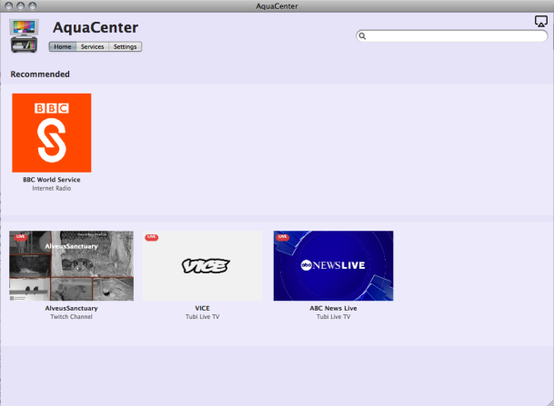

  

<h1 align="center">AquaCenter</h1>

  A native Cocoa media center for PowerPC Macs.

## Overview

AquaCenter is a PowerPC media center that brings AirPlay casting, Moonlight game streaming, live TV, internet radio, Plex, SoundCloud, Twitch, and other media services into a single Mac OS X application. It is built for Leopard-era PowerPC hardware with a native Cocoa interface and a C++ media pipeline tuned for older machines. The concept and design were inspired by other media centers like Kodi and Plex.

The project is in active development. Current builds target Mac OS X 10.5, with PowerPC G4 and G5 build presets. 

## Features

AquaCenter is designed as a series of integrations that all rely on the same player backend. Some notable features include:

- Native Cocoa library and playback interface
- FFmpeg-backed playback with PPC-tuned OpenGL video output
- AirPlay receiver support with live metadata and playback controls 
- Moonlight-compatible client - low latency desktop streaming (includes controller support)
- YouTube, Twitch, SoundCloud, podcasts, weather, and search integrations
- Plex client with library browsing for movies, shows, seasons, and episodes
- Support for FAST service providers like Plex TV, Tubi, Samsung TV Plus, Xumo, and custom M3U playlists
- Internet radio support with provider artwork where available
- OAuth backed login flows for authenticated services (using with PowerFox is highly recommended)
- Continue Watching and Continue Listening sections
- Auto-update, onboarding, performance metrics and more

## Requirements

To run AquaCenter, you need:

- A (fast) G4 or G5 Mac 
- Mac OS X 10.5 Leopard (also tested with the Snow Leopard PPC Alpha)

Game Streaming requires:
- Host PC with Sunshine installed
- Suitable network environment (wired connection highly recommended)
- G5 highly recommended 

SoundCloud requires you to login before streaming.

Plex requires your own Plex account/server.

AirPlay requires a compatible audio source. 

In the future I plan to add support for Mac OS X 10.4 Tiger and maybe create a Universal Binary.

## Status

AquaCenter is alpha software. The application is usable, but playback experience may vary. APIs for streaming providers change frequently and some features remain experimental. Currently I am the only developer and I am working on this project in my spare time.

## Troubleshooting

A lot of issues can be resolved by just restarting the app. Feel free to open an issue until I can put more content here. 

## Acknowledgements

AquaCenter uses work from the FFmpeg project for media demuxing, decoding, filtering, and resampling. It also uses shairport-sync for AirPlay functionality, and code from the Moonlight Game Streaming Project.
PowerPC development depends on the PPCPorts and MacPorts ecosystem, including compiler and library ports maintained for legacy Macs.

The app icon was created by maxtron95.
